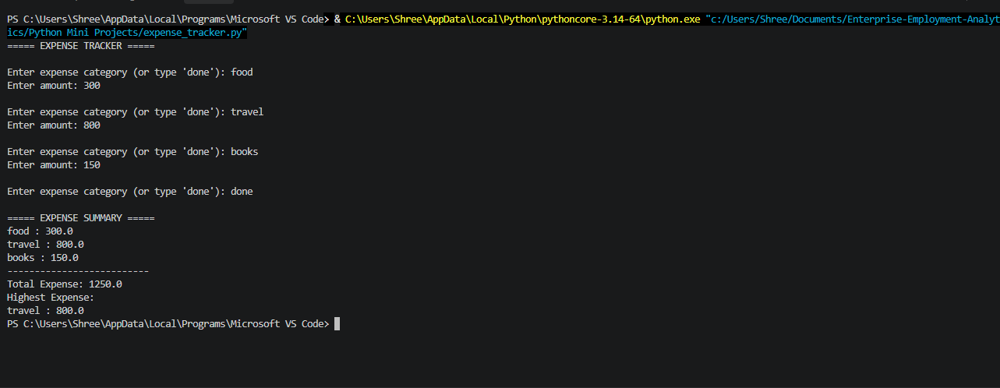
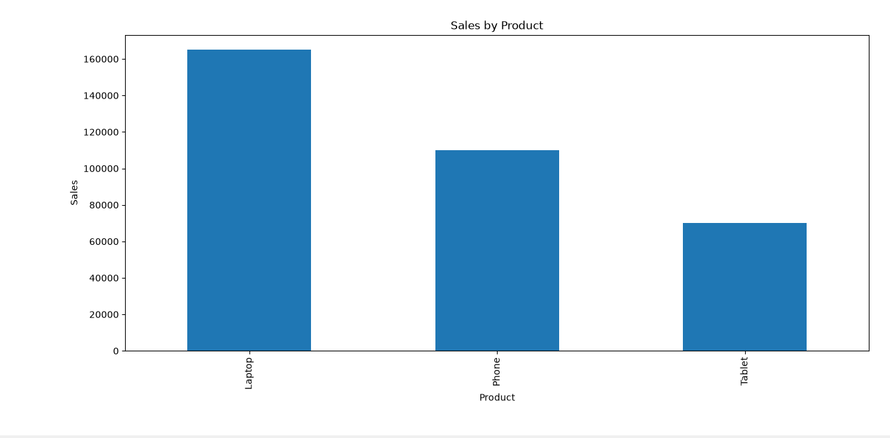

# 🐍 Python Mini Projects

A collection of Python mini-projects created to strengthen programming,
data handling, problem-solving, and data visualization skills.

## 📌 Projects

### 1. 🎓 Student Marks Analyzer

A Python program that analyzes student marks and generates a complete result.

**Features:**
- Calculates total marks
- Calculates percentage
- Assigns grade
- Displays Pass/Fail result

### 2. 💰 Expense Tracker

A console-based Python application for recording and analyzing expenses.

**Features:**
- Add expenses by category
- Calculate total expenses
- Find the highest expense
- Display expense summary

### 3. 📊 Sales Data Analyzer

A Python data-analysis project that analyzes product sales and creates a bar chart.

**Features:**
- Calculates total sales
- Calculates average sales
- Identifies the best-selling product
- Creates a sales visualization

## 🛠️ Technologies Used

- Python
- Pandas
- Matplotlib

## 🎯 Learning Goals

- Python programming
- Problem-solving
- Data handling
- Data analysis
- Data visualization
- ## 📸 Project Outputs

### Student Marks Analyzer

### Expense Tracker

### Sales Data Analyzer

## 👩‍💻 Author

**Karuna Suryawanshi**

BCA Student | Python | SQL | Data Analytics
